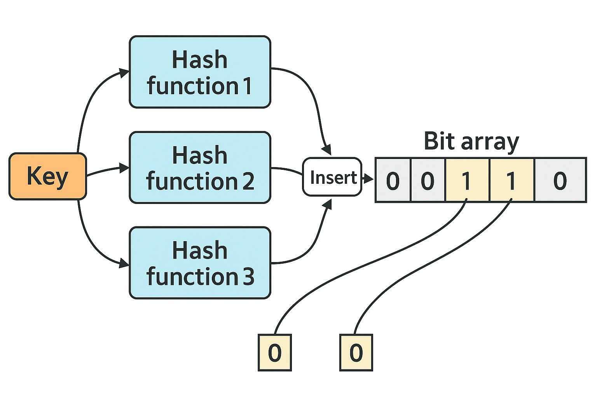
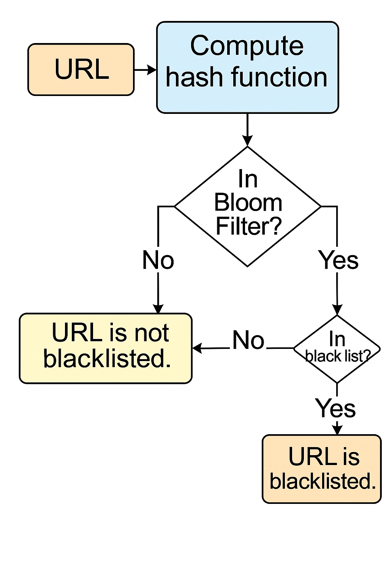

# 🚀 URL Blacklist Filter Application

## 📖 About the Project
This project implements a URL filtering system based on a Bloom Filter.  
The application allows users to add URLs to a blacklist and check if URLs are blacklisted, using a probabilistic, memory-efficient data structure.

The program continuously reads commands from the user:
- Add a URL to the blacklist.
- Check if a URL is blacklisted.

Both the Bloom Filter and the blacklist are saved to disk after every update and automatically loaded on program startup.

---

### 🧠 What is a Bloom Filter?
A Bloom Filter is a space-efficient probabilistic data structure used to test whether an element is a member of a set.  
It allows for false positives but guarantees no false negatives, making it ideal for quick membership checks with limited memory.

---

## 🛠️ Technologies Used
- C++17
- CMake
- GoogleTest (GTest) for unit testing
- Docker

---

## 🧩 Diagrams and Process Flows

### 1. Bloom Filter Structure

<p align="center">
  
</p>

**Description:**  
This diagram illustrates how a key (such as a URL) is processed by multiple hash functions, each mapping to an index in the bit array.  
The corresponding bits are set to `1` to indicate that the key has been "inserted" into the Bloom Filter.

---

## 📷 URL Check Logic Flowchart

<p align="center">
  
</p>

**Description:**  
This flowchart illustrates the process of checking whether a URL is blacklisted:  
First, the hash is computed and checked in the Bloom Filter.  
If the Bloom Filter indicates a possible match, the real blacklist is checked for confirmation.

---

## 🛠️ Build and Run Instructions

### 📦 Build the Project
From the project root directory, open a terminal and run:

```
mkdir build
cd build
cmake ..
cmake --build .
```

### ▶️ Run the Application
After building the project, execute:

```
./app_main
```
> Replace `app_main` with your application executable name if different.

### 🧪 Run the Unit Tests
To run the unit tests:

```
./runTests
```

---

## 🧩 Command Guide

| Command Example         | Description                                        |
|--------------------------|----------------------------------------------------|
| `1 www.example.com0`      | Add URL `www.example.com0` to the blacklist        |
| `2 www.example.com0`      | Check if URL `www.example.com0` is blacklisted     |
| Invalid input            | Will be ignored and skipped automatically         |

---

## ⚙️ First Line Input Format
The very first line the program reads **must** define the Bloom Filter setup:
```
[array size] [repeat count for hash function 1] [repeat count for hash function 2] ...
```
- **First number**: Size of the Bloom Filter's bit array (in bits).
- **Following numbers**: How many times to apply each corresponding hash function.
- Each number after the first represents one hash function configuration.
- The total number of following numbers determines how many different hash functions are used.

**Example 1:**
```
100 1
```
- Array size: 100 bits
- 1 hash function, applied once.

**Example 2:**
```
256 2 1
```
- Array size: 256 bits
- Two hash functions:
  - The first function applied twice.
  - The second function applied once.

---

## 📋 Usage Examples

### Example 1:
**Input:**
```
8 1 2
2 www.example.com0
```
**Output:**
```
false
```

**Input:**
```
1 www.example.com0
2 www.example.com0
```
**Output:**
```
true true
```

**Input:**
```
2 www.example.com1
```
**Output:**
```
false
```

---

### Example 2:
**Input:**
```
8 1
1 www.example.com0
2 www.example.com0
2 www.example.com1
```
**Output:**
```
true true
true false
```

---

### Example 3:
**Input:**
```
8 2
1 www.example.com0
2 www.example.com0
2 www.example.com4
```
**Output:**
```
true true
true false
```

---

## 📝 Notes
- Both the Bloom Filter and the blacklist are saved to disk after every update.
- On startup, the program automatically loads the previously saved Bloom Filter and blacklist, **only if** the parameters specified in the first input line match the previous configuration.
- Invalid input lines are ignored.
- The program automatically handles false positives by checking the real blacklist when needed.
- False positives may occur, but false negatives are not possible.

---

## 🧠 Development Approach
- The project was developed using the principles of Test-Driven Development (TDD).
- The code design follows SOLID principles.
- The project architecture is based on Object-Oriented Programming (OOP) concepts to ensure modularity, scalability, and ease of maintenance.

---
