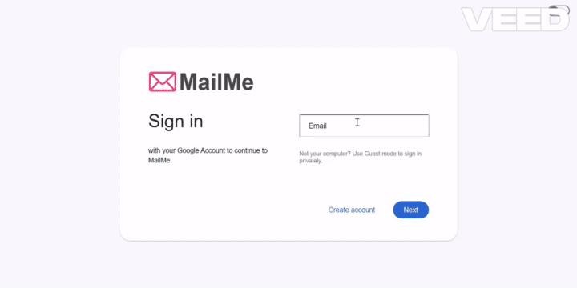
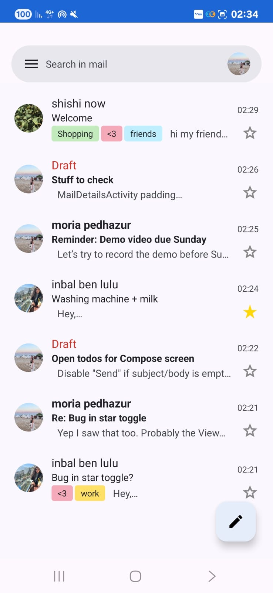
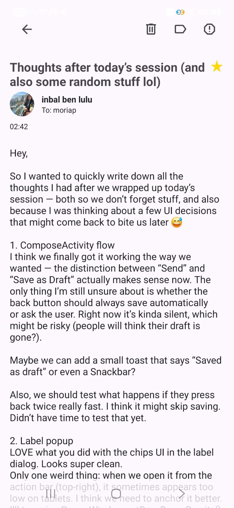
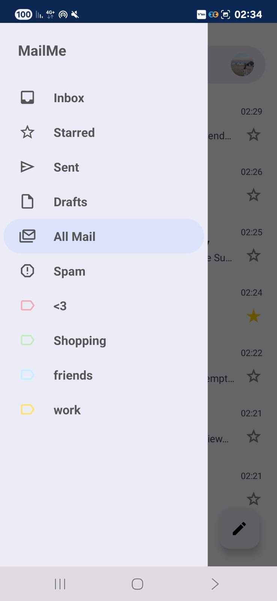

# MailMe 📬

**MailMe** is a full-stack Gmail-style email platform with a **React Web Client** 🌐, **Android App** 📱.  
It supports account management, sending/receiving emails, labels, categories, drafts, and real-time updates — designed to work seamlessly on both desktop and mobile.

---

## 🎥 Live Demos

| Web Client 🌐 | Android App 📱 |
|:-------------:|:--------------:|
|  |    |

  ▶️ <a href="wiki/images/web/web_demo.gif">Watch full Web demo</a> • 
  ▶️ <a href="wiki/images/app/app_demo.gif">Watch full Android demo</a>

---

## 📖 Documentation & Setup

For full setup instructions, Docker usage, and detailed explanations of the project components, see:  
👉 [Full System Setup Guide](wiki/FullSystemSetup.md)
