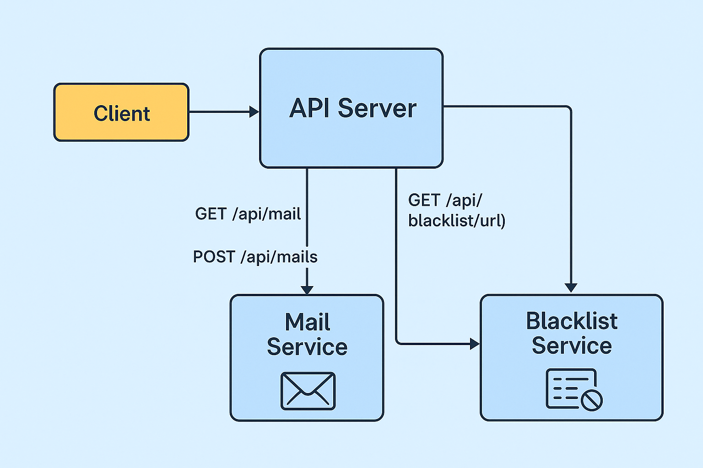

# Mail Server with Blacklist Filtering

## About the Project

This project implements a full web-based mail system using **Node.js (Express)** for the API and a **C++ server** for URL filtering via a **Bloom Filter**.  
The system allows users to register, log in, send/receive emails, manage labels, and ensures outgoing mail content is safe by checking all URLs against a blacklist.

The two components communicate using TCP sockets:
- Node.js REST API handles users, mails, and labels.
- The C++ server filters and stores potentially malicious URLs using a probabilistic Bloom Filter and persistent blacklist.

---
##  Diagram



> **Diagram Explanation:**  
> This diagram illustrates the architecture of the mail system.  
> The client communicates with the central API Server, which handles user requests.  
> When a user sends or retrieves an email (e.g., via `POST /api/mails` or `GET /api/mail`),  
> the API interacts with the Mail Service to store or retrieve messages.  
> Before sending, the API also queries the Blacklist Service to verify that all URLs in the message content are safe.  
> All communication between services occurs over HTTP or TCP, depending on the implementation.
---

##  Build and Run Instructions
From the project root directory, open a terminal and run:

### Build All Services

```
docker-compose build
```

### Create shared Docker network
```
docker network create mail_service
```

### Run the C++ blacklist server

```
docker rm -f server 2>$null
```
```
docker run --name server --network mail_service -w /usr/src/project/build -v "${PWD}/blacklist_service/data:/usr/src/project/build/data" project-server 8080 <ARRAY_SIZE> <hash1_repeat> <hash2_repeat> ...

```

### In a separate terminal, start the Node.js mail API
```
docker-compose up mail_api
```

### Run the Tests

```
docker-compose run --rm tests
```

## API Endpoints

### Authentication

| Endpoint          | Method | Description         | Requires Auth | Example curl                                                                                          | Expected Response       |
|-------------------|--------|---------------------|----------------|--------------------------------------------------------------------------------------------------------|-------------------------|
| `/api/users`      | POST   | Register new user   | No             | `curl -i -X POST http://localhost:3000/api/users -H "Content-Type: application/json"`<br>`-d '{"firstName": "...", "lastName": "...", "email": "...", "password": "...", "dateOfBirth": "..."}'` | `201 Created`<br>JSON of user without password<br>`400` if missing/invalid |
| `/api/users/:id`  | GET    | Get user info       | Yes            | `curl -i -X GET http://localhost:3000/api/users/<user ID> -H "userId: <user ID>"`                        | `200 OK`<br>user JSON<br>`404` if not found |
| `/api/tokens`     | POST   | Login user          | No             | `curl -i -X POST http://localhost:3000/api/tokens -H "Content-Type: application/json"`<br>`-d '{"email": "...", "password": "..."}'` | `200 OK` with user ID<br>`401` if credentials are invalid  |

---

### Mails

| Endpoint                    | Method  | Description                       | Requires Auth | Example curl                                                                                                                  | Expected Response         |
|-----------------------------|---------|-----------------------------------|----------------|------------------------------------------------------------------------------------------------------------------------------|---------------------------|
| `/api/mails`                | GET     | Get up to 50 mails for user       | Yes            | `curl -i -X GET http://localhost:3000/api/mails -H "userId: <user ID>"`                                                        | `200 OK` with mail array |
| `/api/mails`                | POST    | Send new mail                     | Yes            | `curl -i -X POST http://localhost:3000/api/mails -H "userId: <user ID>" -H "Content-Type: application/json"`<br>`-d '{"to": ["<email>"], "subject": "...", "body": "..."}'` | `201 Created` with Location<br>`400` if blacklist match or no recipients<br>`404` if recipient not found |
| `/api/mails/:id`            | GET     | Get specific mail                 | Yes            | `curl -i -X GET http://localhost:3000/api/mails/<id> -H "userId: <user ID>"`                                                   | `200 OK` with mail<br>`404` if not found |
| `/api/mails/:id`            | PATCH   | Update subject/body (sender only) | Yes            | `curl -i -X PATCH http://localhost:3000/api/mails/<id> -H "userId: <user ID>" -H "Content-Type: application/json"`<br>`-d '{"subject": "..."}'` | `204 No Content`<br>`400` if blacklist match or forbidden field<br>`404` if not found |
| `/api/mails/:id`            | DELETE  | Remove mail from user view        | Yes            | `curl -i -X DELETE http://localhost:3000/api/mails/<id> -H "userId: <user ID>"`                                                 | `204 No Content`<br>`404` if not found |
| `/api/mails/search/:query` | GET     | Search mails                      | Yes            | `curl -i -X GET http://localhost:3000/api/mails/search/<query> -H "userId: <user ID>"`                                          | `200 OK` (empty array if none)<br>`400` if query is missing |

---

### Labels

| Endpoint              | Method | Description         | Requires Auth | Example curl                                                                                                            | Expected Response       |
|-----------------------|--------|---------------------|----------------|------------------------------------------------------------------------------------------------------------------------|-------------------------|
| `/api/labels`         | GET    | List all labels     | Yes            | `curl -i -X GET http://localhost:3000/api/labels -H "userId: <user ID>"`                                                 | `200 OK` with array     |
| `/api/labels`         | POST   | Create new label    | Yes            | `curl -i -X POST http://localhost:3000/api/labels -H "userId: <user ID>" -H "Content-Type: application/json"`<br>`-d '{"name": "Work"}'` | `201 Created`<br>`400` if name missing or duplicate |
| `/api/labels/:id`     | GET    | Get label by ID     | Yes            | `curl -i -X GET http://localhost:3000/api/labels/<id> -H "userId: <user ID>"`                                             | `200 OK`<br>`404` if not found or invalid |
| `/api/labels/:id`     | PATCH  | Rename label        | Yes            | `curl -i -X PATCH http://localhost:3000/api/labels/<id> -H "userId: <user ID>" -H "Content-Type: application/json"`<br>`-d '{"name": "NewName"}'` | `204 No Content`<br>`404` if not found<br>`400` if name exists |
| `/api/labels/:id`     | DELETE | Delete label        | Yes            | `curl -i -X DELETE http://localhost:3000/api/labels/<id> -H "userId: <user ID>"`                                          | `204 No Content`<br>`404` if not found or invalid |

---

### Blacklist

| Endpoint               | Method | Description              | Requires Auth | Example curl                                                                                                                  | Expected Response        |
|------------------------|--------|--------------------------|----------------|------------------------------------------------------------------------------------------------------------------------------|--------------------------|
| `/api/blacklist`       | POST   | Add URL to blacklist     | No             | `curl -i -X POST http://localhost:3000/api/blacklist -H "Content-Type: application/json"`<br>`-d '{"url": "<url>"}'`         | `201 Created`<br>`400` if missing or invalid<br>`500` on server error |
| `/api/blacklist/:id`  | DELETE | Remove URL from blacklist| No             | `curl -i -X DELETE http://localhost:3000/api/blacklist/http%3A%2F%2Fexample.com%2Fmalicious`                                 | `204 No Content`<br>`404` if not found<br>`400` if invalid<br>`500` on error |


---

## Data Storage

All data in the Node.js mail API (users, mails, labels) is stored **in-memory**.  
Restarting the server will erase all current state.  
Only the C++ blacklist server persists data to disk (via files).

---

## URL Blacklist Server Integration

The mail API integrates with a dedicated C++ **Blacklist Server** over TCP sockets.  
Every time a mail is sent or updated, the API extracts all URLs from the content and checks them against the blacklist server using line-based commands.  
If any URL is found to be blacklisted, the request is rejected and not stored.

---

## API Format

All endpoints follow **RESTful** conventions and respond in **JSON** only.  
There is no HTML rendering or templating involved.

---

## Full Example Execution

This is a full example run showing how to register users, log in, send an email, and retrieve it.

### Register user Dana

```
curl -i -X POST http://localhost:3000/api/users \
  -H "Content-Type: application/json" \
  -d '{
    "firstName": "Dana",
    "lastName": "Rosen",
    "email": "dana@mail.com",
    "password": "abcd1234",
    "dateOfBirth": "1998-04-12",
    "gender": "female",
    "phoneNumber": "0523456789"
  }'
```

Expected Response:
```
HTTP/1.1 201 Created
...
{
  "userId": 1,
  "firstName": "Dana",
  "lastName": "Rosen",
  "email": "dana@mail.com",
  "dateOfBirth": "1998-04-12",
  "gender": "female",
  "phoneNumber": "0523456789"
}
```

### Register user Bob

```
curl -i -X POST http://localhost:3000/api/users \
  -H "Content-Type: application/json" \
  -d '{
    "firstName": "Bob",
    "lastName": "Cohen",
    "email": "bob@mail.com",
    "password": "pass123",
    "dateOfBirth": "1995-10-10"
  }'
```

Expected Response:
```
HTTP/1.1 201 Created
...
{
  "userId": 2,
  "firstName": "Bob",
  "lastName": "Cohen",
  "email": "bob@mail.com",
  "dateOfBirth": "1995-10-10",
  "gender": null,
  "phoneNumber": null
}
```

### Login as Dana

```
curl -i -X POST http://localhost:3000/api/tokens \
  -H "Content-Type: application/json" \
  -d '{
    "email": "dana@mail.com",
    "password": "abcd1234"
  }'
```

Expected Response:
```
HTTP/1.1 200 OK
...
{
  "userId": 1
}
```

### Send mail from Dana to Bob

```
curl -i -X POST http://localhost:3000/api/mails \
  -H "userId: 1" \
  -H "Content-Type: application/json" \
  -d '{
    "to": ["bob@mail.com"],
    "subject": "Hi Bob",
    "body": "This is safe"
  }'
```

Expected Response:
```
HTTP/1.1 201 Created
X-Powered-By: Express
Location: /api/mails/1
...
```

### Get all mails for Bob

```
curl -i -X GET http://localhost:3000/api/mails \
  -H "userId: 2"
```

Expected Response:
```
HTTP/1.1 200 OK
...
[
  { 
    "id": 1,
    "subject": "Hi Bob",
    "sentAt": "2025-05-28T12:41:27.331Z",
    "from": "Dana Rosen",
    "to": [
      "Bob Cohen"
    ]
  }
]
```