# MailMe – Web Mail System

- [Run the project](#running-the-project)
- [UI features](#features-ui-screenshots-included)
- [Spam filtering logic](#spam-filtering)


## Overview

**MailMe** is a full-stack email platform with a modern UI and built-in security. It combines:

- A **C++ URL filtering server** that prevents sending messages with blacklisted URLs using a **Bloom Filter**.
- A **Node.js API** for managing users, mails, labels and authentication.
- A **React-based client** providing a Gmail-like user experience with support for drafts, labels, stars, spam, and more.

---

## Features (UI Screenshots Included)

### Sign In

Users can sign in using a simple.

This screen is intended for **existing accounts only**.

New users should use the **Create Account** option instead.

<p align="center">
  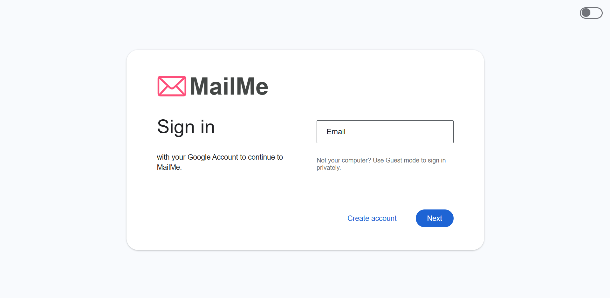
</p>

---

### Create Account

Users can easily register through a clean, multi-step signup process.

<p align="center">
  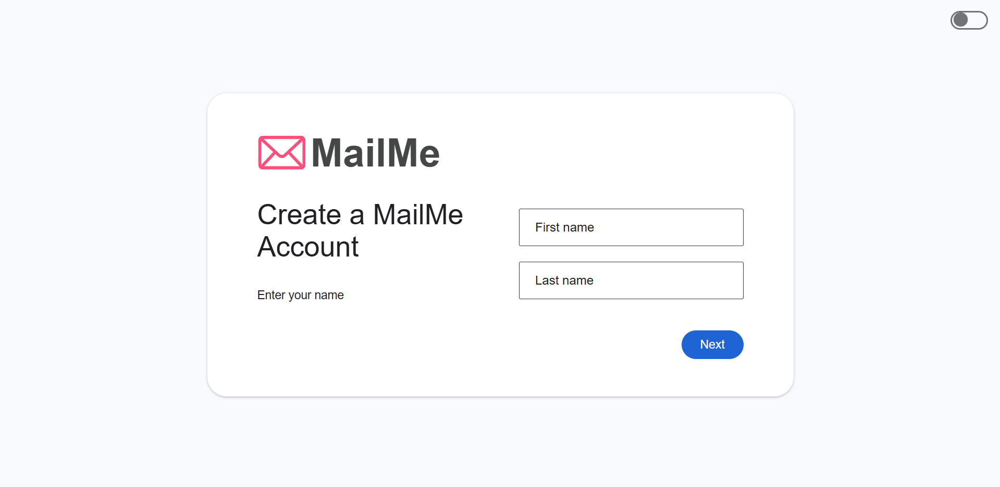
</p>

---

### Mail Interface

The main interface includes access to Inbox, Sent, Drafts, Spam, and All Mail.

Labels appear on the left and can be managed directly.

To compose a new mail, click the **COMPOSE** button.

<p align="center">
  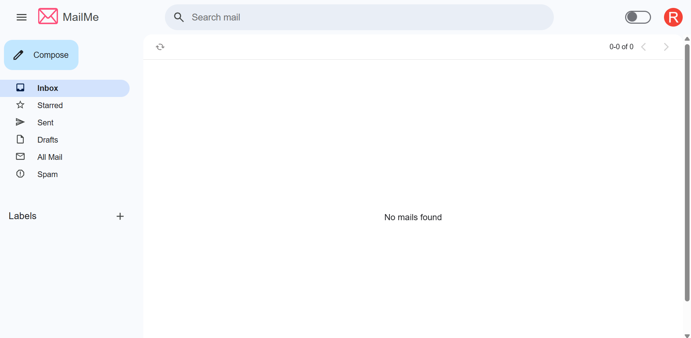
</p>

---

### Create New Label

You can create new labels via the sidebar `+` icon.

<p align="center">
  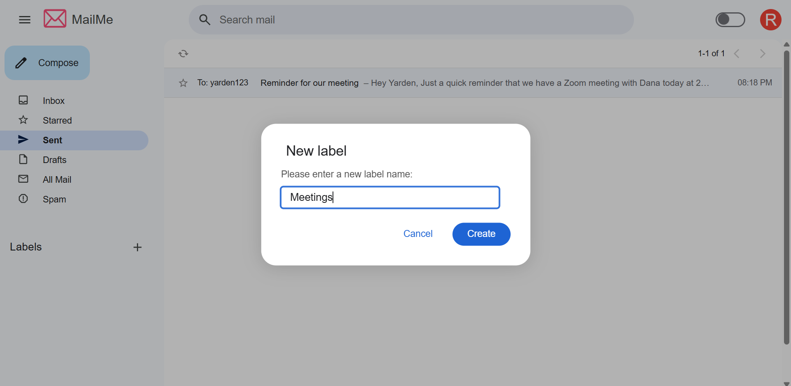
</p>

---

### Label Management


Labels can be customized directly from the sidebar using the three-dot menu next to each label.
You can:

Rename the label

Delete the label

Choose a custom label color from a palette of 20 options

This helps organize your emails visually and functionally.

<p align="center">
  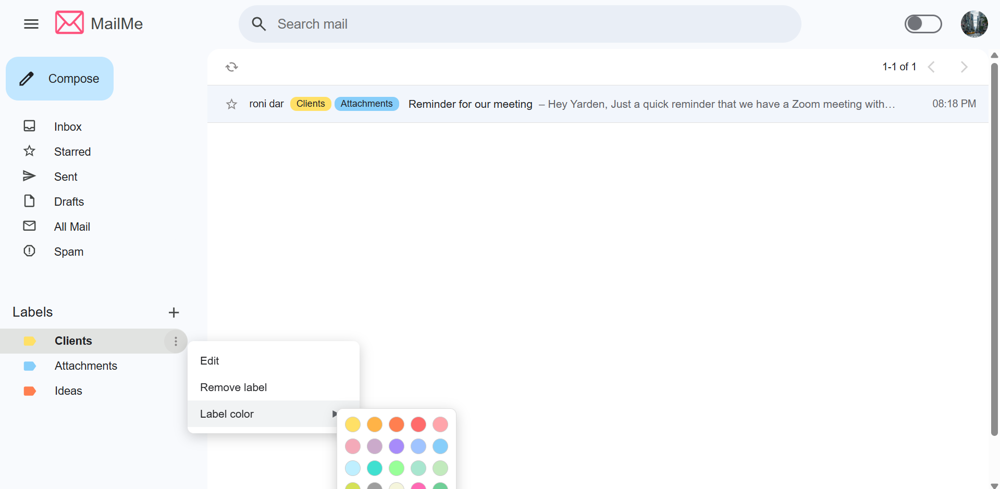
</p>

---

### Right-click Label Assignment

Right-clicking on a mail item opens a label menu.

You can select or deselect labels, or create a new one from there.

<p align="center">
  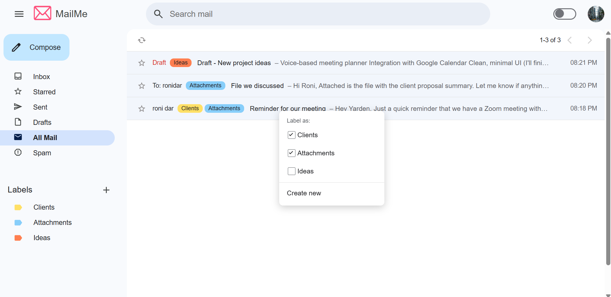
</p>

---

### Open & Read Emails

Clicking on a mail opens it in full view.

You can star it, delete it, or mark as spam.

Each mail displays its assigned labels clearly in the list.


<p align="center">
  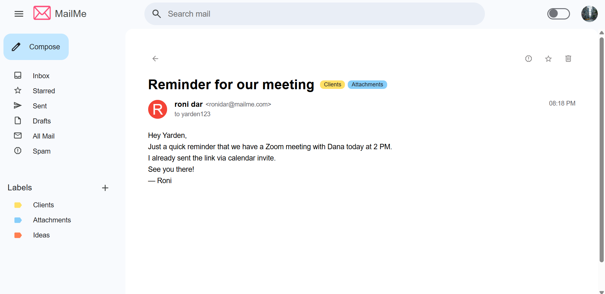
</p>

---

### Quick Mail Action via Hover Card

Hovering over or clicking on a sender's profile picture opens a hover card with their name, email address, and a "Send mail" button.

<p align="center">
  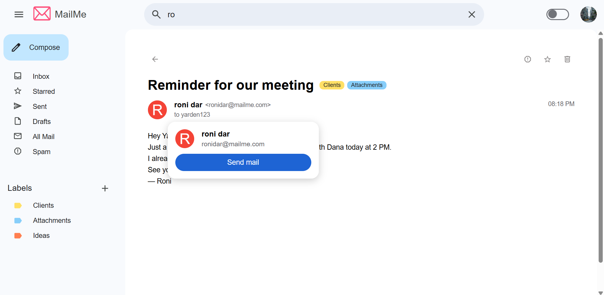
</p>

---

### Drafts and Compose Flow

Typing in the search bar shows up to 5 recent emails that match your query, based on subject, sender, or content.

You can view all matching results by clicking "All search results" at the bottom of the dropdown.

<p align="center">
  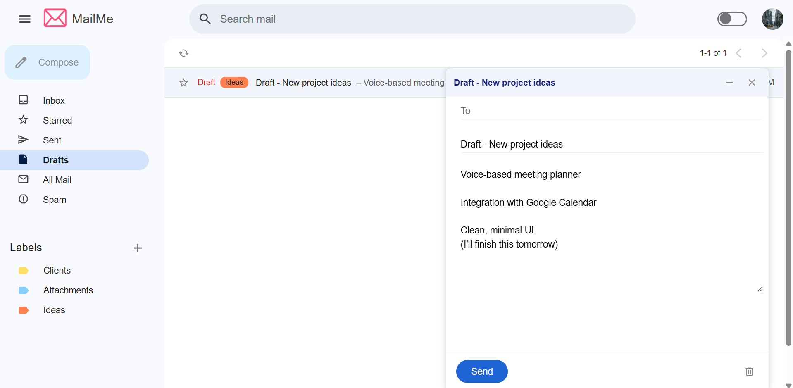
</p>

---

### Mail Search

Emails that haven’t been sent are saved as drafts and can be resumed later.

<p align="center">
  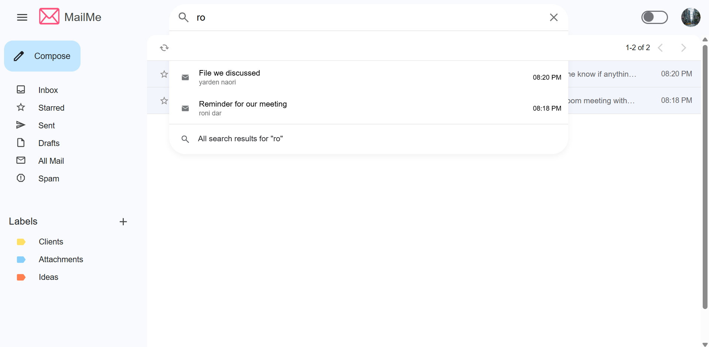
</p>

---

### Profile Picture Management

You can set or change your profile picture by clicking the user avatar in the top-right and editing your personal details.

If no picture is uploaded, a default avatar will be shown based on the **first letter of the user's email address**.

Profile pictures are displayed across the app — including in the full mail view and hover cards.

<p align="center">
  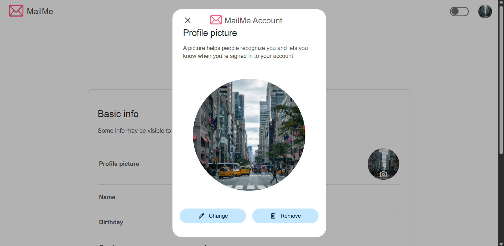
</p>

---

## Running the Project

Follow the steps below to run the full MailMe system locally using Docker:

### Build All Services

```
docker-compose build
```

### Create shared Docker network
```
docker network create mail_service
```

### Run the C++ blacklist server

```
docker rm -f server 2>$null
```
```
docker run --name server --network mail_service -w /usr/src/project/build -v "${PWD}/blacklist_service/data:/usr/src/project/build/data" project-server 8080 <ARRAY_SIZE> <hash1_repeat> <hash2_repeat> ...
```

### In a separate terminal, start the Node.js mail API
```
docker-compose up mail_api
```

### In a separate terminal, Launch the React Mail Client
```
docker-compose up mail_client
```
---
### Run the Tests

```
docker-compose run --rm tests
```

## Spam Filtering

When a user marks a mail as **spam**, all URLs within that mail are extracted and added to the **blacklist** using a **C++ server with Bloom Filter** logic.

From that moment on, **any future mail containing any of these URLs will be automatically classified as spam for all users**, even before reaching their inbox.

This mechanism provides a collaborative spam defense system:
- A single spam report strengthens protection for everyone.
- Thanks to the Bloom Filter, URL checks are extremely fast and space-efficient.

If a user later **removes a mail from spam**, the system performs the reverse action:  
All URLs extracted from that mail are removed from the blacklist, and future messages containing those URLs will no longer be flagged as spam.
