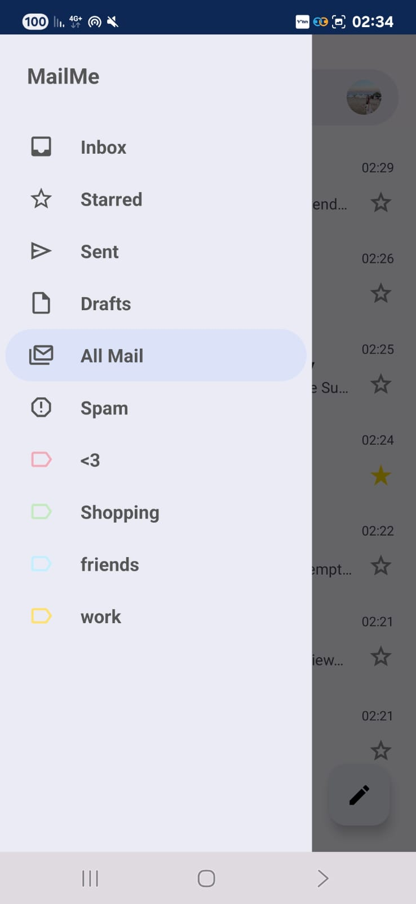
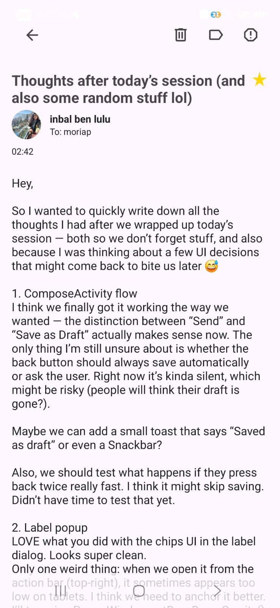

# MailMe – Android App


- [Running the App](#running-the-app)
- [Offline Mode Support](#offline-mode-support)
- [UI Features](#features-ui-screenshots-included)

---
# Overview

This guide explains how to build, run, and connect the Android app to your local server.


>If you haven’t already launched the full backend and services,
> please follow the [Full Setup Guide](FullSystemSetup.md) first.

---

## Offline Mode Support

The Android app supports **offline viewing** of previously loaded content, such as:

- Mail inbox and categories
- Drafts
- Labels and user data

This allows users to browse their mail even without an active internet connection.

> However, actions such as:
> - Sending new emails
> - Updating drafts
> - Marking as spam or starred
> - Label management
>
> **require an active internet connection (Wi-Fi or data).**

If no connection is available, the app will show an error message and prevent those actions from being submitted.

---

## Features (UI Screenshots Included)


### Create Account

Users can easily register through a clean, multi-step signup process.

In step 5, to proceed, users should tap the arrow button at the top-left corner.

<p align="center">
  
  
  
  
  
</p>

---

### Sign In

Users can sign in using a simple and secure login screen.

This screen is intended for **existing accounts only**.

New users should use the **Create Account** option instead.

<p align="center">
  
</p>

---

### Mail Interface

The main interface includes access to Inbox, Sent, Drafts, Spam, and All Mail.

Navigation is handled through the **sidebar**, located on the left side of the screen.
It allows users to quickly switch between categories and user-defined labels, with the mail list updating dynamically based on the selected item.

To compose a new mail, tap the **pencil icon** at the bottom right corner of the screen.

<p align="center">
  
  
  
  
</p>

---

### Long-Press Actions on Emails

Long-pressing on an email opens **selection mode**, allowing you to perform bulk actions on one or more mails.

Once selected, you can:

- Delete the mail
- Mark it as spam
- Assign or remove labels

<p align="center">
  
  
</p>

---

### Open & Read Emails

Clicking on a mail opens it in full view.

You can star it, delete it, or mark as spam.

Each mail displays its assigned labels clearly in the list.


<p align="center">
  
</p>

---

### Drafts and Compose Flow

Emails that haven’t been sent are saved as drafts and can be resumed later.

<p align="center">
  
</p>

---

### Mail Search

Typing in the search bar shows up to 5 recent emails that match your query, based on subject, sender, or content.

You can view all matching results by clicking "All search results" at the bottom of the dropdown.


<p align="center">
  
</p>

---

### Profile Picture Management

You can manage your profile picture by clicking the user avatar in the top-right corner.
From there, you can access both the **Personal Info** screen and the **Change Picture** screen.

If no picture is uploaded, a default avatar will be shown based on the first letter of your email address.

Profile pictures are displayed throughout the app — including the full mail view, personal details, and hover cards.

<p align="center">
  
  
</p>

---

## Running the App

Follow the steps below to launch the **MailMe app** using Android Studio.

> Haven’t set up the full backend yet? Start with the [Full Setup Guide](FullSystemSetup.md)

---

### Quick Navigation
- [Case A: Run on Emulator (default, no config needed)](#case-a-run-on-emulator)
- [Case B: Run on Physical Device (with network setup)](#case-b-run-on-physical-android-device)

---

### Case A: Run on Emulator
If you’re running the app using an **Android emulator in Android Studio**, no IP or configuration changes are needed.

1. Open the project in Android Studio (mail_app/)

2. Make sure an emulator is installed and selected (e.g., Pixel API 30)

3. Click the green Run button at the top

4. The app will build and launch on the emulator

You can now register, sign in, and use all mail features

### Case B: Run on Physical Android Device

If you're running the app on a real Android phone, follow these steps to allow the app to connect to your local server.

---

#### Step 1: Set Up the Network

Before anything else:

1. **Turn on hotspot on your phone**
2. **Connect your computer to that hotspot**
   > This puts the phone and computer on the same local network — required for communication

---

#### Step 2: Find Your Computer’s Local IP Address

On your PC (connected to your phone’s hotspot), open **CMD** or **PowerShell** and run:

```
ipconfig
```
Look for this section:
```
Wireless LAN adapter Wi-Fi:
    IPv4 Address. . . . . . . . . . . : xxx.xxx.xxx.xxx
```
This is your PC’s IP on the local network.
Save this IP — you'll use it in the next step.

#### Step 3: Set the IP in strings.xml
Edit this file:
mail_app/app/src/main/res/values/strings.xml
Change:
```
<string name="BaseUrl">http://10.0.2.2:4000/api/</string>
```
To:
```
<string name="BaseUrl">http://192.168.1.42:4000/api/</string> <!-- Replace with your real IP -->
```
10.0.2.2 works only for emulators. Physical devices must use the real IP.

#### Step 4: Open Port 4000 in Windows Firewall
On your PC, open PowerShell as Administrator and run:
```
New-NetFirewallRule -DisplayName "Allow Node.js Port 4000" -Direction Inbound -LocalPort 4000 -Protocol TCP -Action Allow
```
This allows your phone to access your server via port 4000.

#### Final Step: Run the App on Your Phone

Once all network and configuration steps are complete:

1. Connect your Android phone to your computer using a USB cable
2. On your phone:
   - Go to **Settings > About phone**
   - Tap **"Build number"** 7 times to unlock **Developer Options**
   - Go back to **Settings > Developer Options**
   - Enable **USB Debugging**
3. In Android Studio, ensure your phone appears in the device dropdown (instead of an emulator)
4. Click the green **Run** button at the top
5. The app will build and install directly on your phone

You can now sign in, compose mails, and test everything — just like on the web.
