# MailMe – Web Mail System

- [Run the project](#running-the-Web-Client)
- [UI features](#features-ui-screenshots-included)

---
# Overview

This page explains how to use the MailMe web interface after the system has been launched.

>If you haven’t already launched the full backend and services,
> please follow the [Full Setup Guide](FullSystemSetup.md) first.

---
## Features (UI Screenshots Included)

### Sign In

Users can sign in using a simple.

This screen is intended for **existing accounts only**.

New users should use the **Create Account** option instead.

<p align="center">
  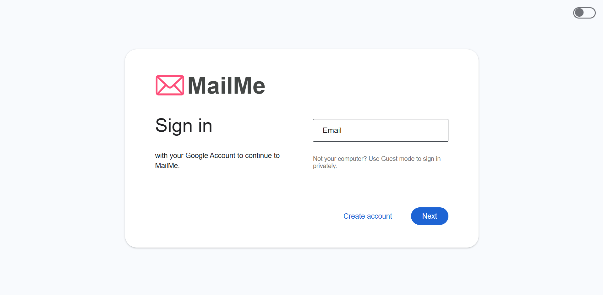
</p>

---

### Create Account

Users can easily register through a clean, multi-step signup process.

<p align="center">
  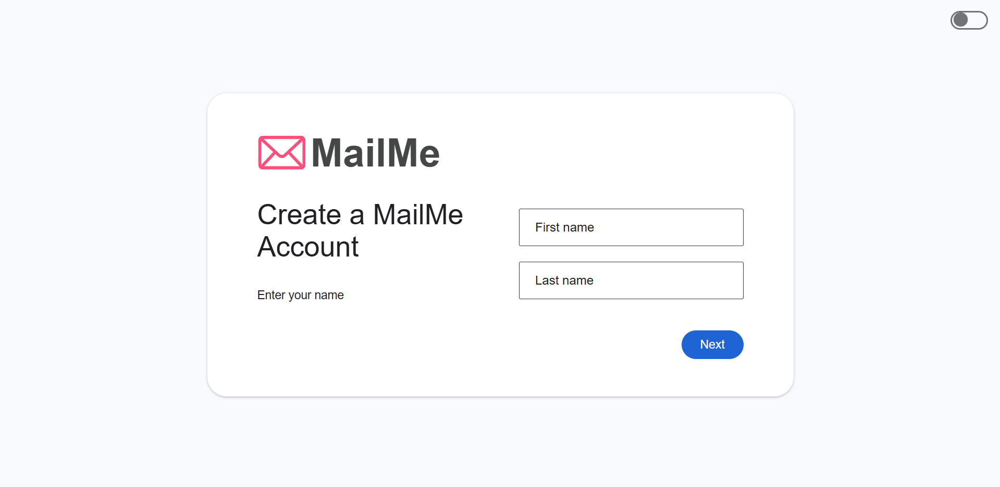
</p>

---

### Mail Interface

The main interface includes access to Inbox, Sent, Drafts, Spam, and All Mail.

Labels appear on the left and can be managed directly.

To compose a new mail, click the **COMPOSE** button.

<p align="center">
  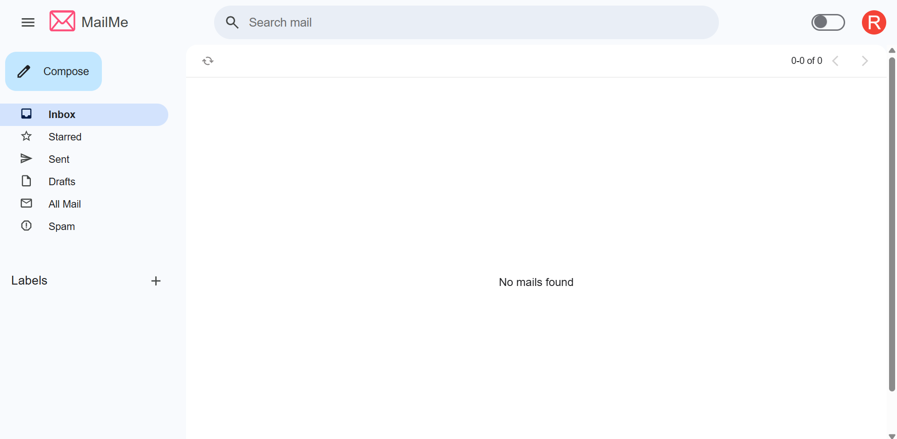
</p>

---

### Create New Label

You can create new labels via the sidebar `+` icon.

<p align="center">
  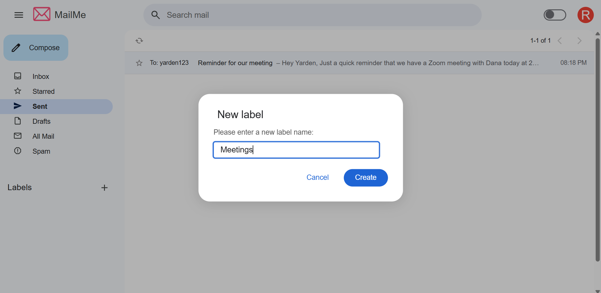
</p>

---

### Label Management


Labels can be customized directly from the sidebar using the three-dot menu next to each label.
You can:

Rename the label

Delete the label

Choose a custom label color from a palette of 20 options

This helps organize your emails visually and functionally.

<p align="center">
  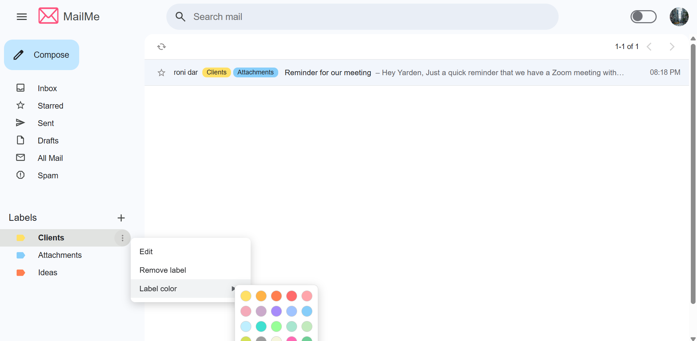
</p>

---

### Right-click Label Assignment

Right-clicking on a mail item opens a label menu.

You can select or deselect labels, or create a new one from there.

<p align="center">
  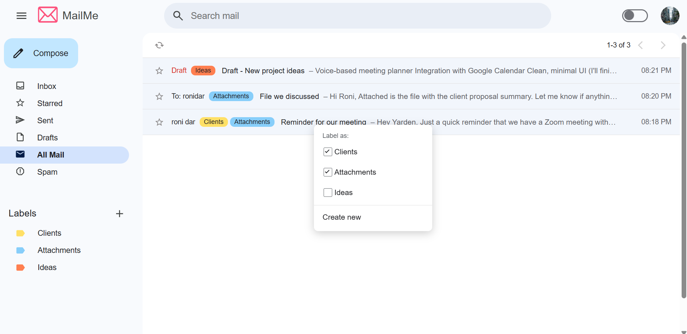
</p>

---

### Open & Read Emails

Clicking on a mail opens it in full view.

You can star it, delete it, or mark as spam.

Each mail displays its assigned labels clearly in the list.


<p align="center">
  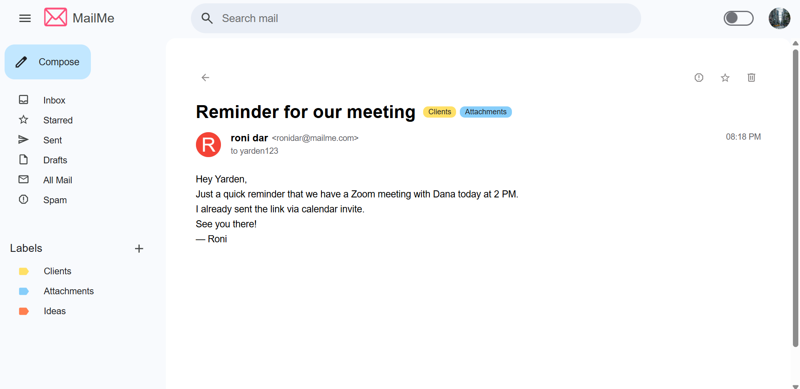
</p>

---

### Quick Mail Action via Hover Card

Hovering over or clicking on a sender's profile picture opens a hover card with their name, email address, and a "Send mail" button.

<p align="center">
  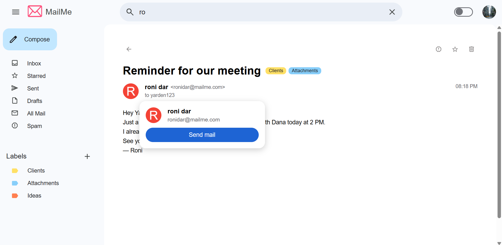
</p>

---

### Drafts and Compose Flow

Typing in the search bar shows up to 5 recent emails that match your query, based on subject, sender, or content.

You can view all matching results by clicking "All search results" at the bottom of the dropdown.

<p align="center">
  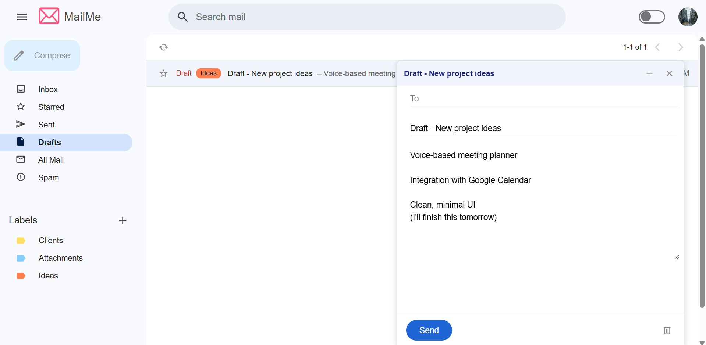
</p>

---

### Mail Search

Emails that haven’t been sent are saved as drafts and can be resumed later.

<p align="center">
  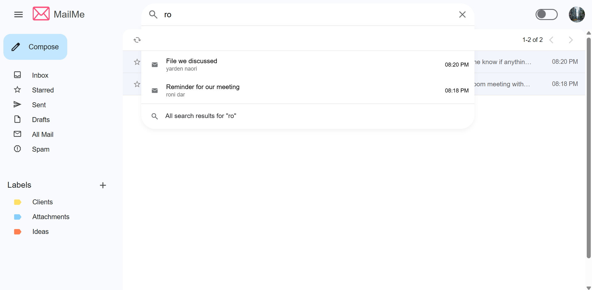
</p>

---

### Profile Picture Management

You can set or change your profile picture by clicking the user avatar in the top-right and editing your personal details.

If no picture is uploaded, a default avatar will be shown based on the **first letter of the user's email address**.

Profile pictures are displayed across the app — including in the full mail view and hover cards.

<p align="center">
  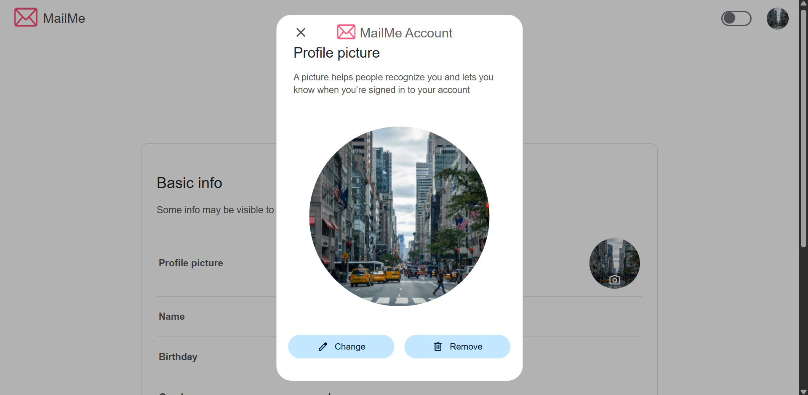
</p>

---

## Running the Web Client

Follow the steps below to launch the **MailMe web app** using Docker.

> Haven’t set up the full backend yet? Start with the [Full Setup Guide](FullSystemSetup.md)

### In a separate terminal, Launch the React Mail Client
```
docker-compose up mail_client
```
---

### Accessing the Application
Once all services are running, you can access the MailMe web client in your browser at:
```
http://localhost:3000
```

From there, you can create a new account and explore all features.